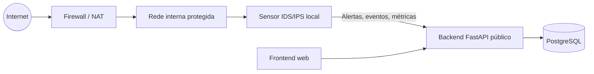

# Arquitetura Para Rede Atrás de Firewall

Este projeto deve ser operado em dois blocos:

- **Bloco interno:** sensor IDS/IPS dentro da rede protegida.
- **Bloco externo:** backend, banco PostgreSQL e frontend web.

## Diagrama

## Responsabilidades

### Dentro da rede
- Capturar tráfego.
- Classificar fluxos e alertas.
- Bloquear IPs ou fluxos quando necessário.
- Operar com acesso à interface de rede ou ao espelhamento de porta.

### Na nuvem
- Autenticação de usuários.
- Histórico de alertas.
- Painel web.
- Relatórios e IA.
- Armazenamento em PostgreSQL.

## Observações práticas

- O sensor não deve ser hospedado em Render/Railway comum se precisar ver tráfego real da LAN.
- Se o sensor estiver atrás da firewall, ele precisa ficar em um host com acesso direto à rede interna ou ao gateway.
- O backend público deve receber somente eventos e consultas, não depender de captura de rede local.
- Se quiser alta segurança, o sensor pode enviar eventos ao backend por HTTPS com autenticação por token.
