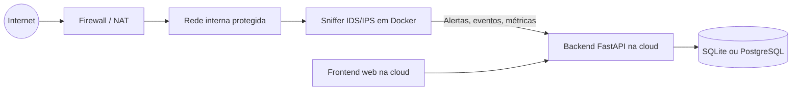

# Arquitetura Para Rede Atrás de Firewall

Este projeto deve ser operado em dois blocos:

- **Bloco interno:** sniffer/IDS/IPS em Docker dentro da rede protegida ou no host com acesso direto às interfaces.
- **Bloco externo:** backend e frontend hospedados na cloud.

## Diagrama

## Responsabilidades

### Dentro da rede
- Capturar tráfego.
- Classificar fluxos e alertas.
- Bloquear IPs ou fluxos quando necessário.
- Operar em Docker com acesso à interface de rede ou ao espelhamento de porta.

### Na nuvem
- Autenticação de usuários.
- Histórico de alertas.
- Painel web.
- Relatórios e IA.
- API para receber eventos do sniffer.

## Observações práticas

- O sniffer não deve ser hospedado em Render/Railway comum se precisar ver tráfego real da LAN.
- Se o sniffer estiver atrás da firewall, ele precisa ficar em um host com acesso direto à rede interna ou ao gateway.
- O backend na cloud deve receber somente eventos e consultas, não depender de captura de rede local.
- Se quiser alta segurança, o sniffer pode enviar eventos ao backend por HTTPS com autenticação por token e WebSocket para atualização em tempo real.
