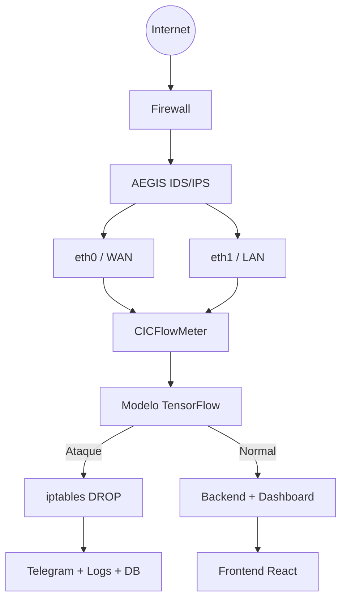

# AEGIS

AEGIS é um sistema IDS/IPS académico full-stack para monitorização de tráfego de rede em tempo real, deteção de ataques com Machine Learning e bloqueio automático de IPs. O projeto combina captura de flows, classificação por IA, alertas em tempo real e painel web para operação e análise.

## Visão geral

O AEGIS foi pensado para operar em duas frentes ao mesmo tempo:

- Observa tráfego externo e interno, incluindo comunicações entre máquinas da rede local.
- Classifica flows de rede como normais ou maliciosos.
- Bloqueia automaticamente o IP atacante com `iptables`.
- Regista alertas e eventos para auditoria e resposta.
- Expõe uma API FastAPI e um dashboard React para gestão centralizada.

## Stack tecnológica

- Frontend: React, TypeScript, Vite e Styled Components.
- Backend: Python, FastAPI, SQLAlchemy e SQLite.
- Machine Learning: TensorFlow/Keras, treinado com o dataset CIC-IDS 2018 e 78 features por flow.
- Captura de tráfego: CICFlowMeter.
- Bloqueio: `iptables`.
- Autenticação: JWT com roles Admin, Analista e Operador.
- Alertas: Telegram Bot.
- Distribuição: Docker e Docker Compose, com o sniffer isolado em container e o frontend/backend hospedados na cloud.

## Arquitetura em camadas



### 1. Internet

Origem de todo o tráfego externo, incluindo utilizadores legítimos e potenciais atacantes.

### 2. Firewall

Primeira linha de defesa. Faz filtragem básica de portas e protocolos. O AEGIS é posicionado depois da firewall para análises mais profundas.

### 3. AEGIS, núcleo do sistema

É aqui que ocorre a monitorização ativa. O sistema opera com duas interfaces de rede em simultâneo:

- `eth0` para tráfego WAN.
- `eth1` para tráfego LAN.

O CICFlowMeter extrai 78 features por flow, o modelo TensorFlow classifica o evento e, se for identificado como ataque, o IP é bloqueado imediatamente com `iptables`.

### 4. Cloud / Servidor

O frontend e o backend ficam hospedados na cloud, em VPS ou infraestrutura da empresa, com acesso ao dashboard, à API e aos dados operacionais.

O backend recebe os eventos do sniffer remoto por HTTPS e WebSocket, enquanto a persistência pode ser mantida em SQLite para cenários académicos ou trocada para PostgreSQL conforme a implantação.

### 5. Sniffer em Docker

O sniffer corre em Docker no host que tem acesso direto à rede monitorizada.

- O container precisa ver as interfaces reais de rede.
- O container precisa de permissões para capturar tráfego e aplicar bloqueios.
- A captura pode ser feita com `network_mode: host` ou configuração equivalente.
- Este componente não deve ser tratado como um serviço web genérico na cloud pública.

### 6. Rede interna

Além do tráfego externo, o AEGIS também monitoriza a rede interna para detetar ameaças laterais, movimentos internos e ataques que a firewall não veria sozinha.

### 7. Bloqueio automático

Quando um ataque é detetado:

- o IP atacante é bloqueado com `iptables DROP`;
- um alerta é enviado via Telegram;
- o evento é guardado na base de dados;
- o dashboard recebe a atualização em tempo real.

## Fluxo de deteção

1. O tráfego é capturado nas interfaces `eth0` e `eth1` pelo sniffer em Docker.
2. O CICFlowMeter transforma pacotes em flows e extrai 78 features.
3. O modelo TensorFlow classifica o flow.
4. Se a predição indicar ataque, o backend ou o agente autorizado executa o bloqueio automático.
5. O sistema grava logs, cria alertas e notifica os operadores.

## Componentes principais

- `backend/main.py`: arranque da API FastAPI e registo dos routers.
- `backend/sniffer_routes.py`: integração com captura, deteção e bloqueio.
- `backend/notification_service.py`: alertas e integrações externas.
- `backend/reports_routes.py`: relatórios e métricas.
- `frontend/src/`: dashboard web em React.
- `backend/models.py` e `backend/schemas.py`: modelos e contratos de dados.

## Estrutura do repositório

- `backend/`: API, serviços, modelos e lógica de segurança.
- `frontend/`: dashboard React.
- `sniffer/` ou serviço equivalente: captura de tráfego e bloqueio em Docker.
- `alembic/`: migrações de base de dados.
- `docs/`: documentação complementar.
- `data/`: saídas, resultados e ficheiros de teste.
- `testes/` e ficheiros `test_*.py`: testes e validações.

## Execução local

### Backend

O backend usa FastAPI e depende do ficheiro `backend/requirements.txt`.

Linux / macOS:

```bash
cd backend
python3 -m venv .venv
source .venv/bin/activate
pip install -r requirements.txt
cd ..
python -m uvicorn backend.main:app --reload --reload-dir backend --reload-exclude ".venv/*"
```

Windows PowerShell:

```powershell
cd backend
python -m venv .venv
.\.venv\Scripts\Activate.ps1
pip install -r requirements.txt
cd ..
python -m uvicorn backend.main:app --reload --reload-dir backend --reload-exclude ".venv/*"
```

Notas:

- Crie um ficheiro `.env` na raiz do projeto com, no mínimo, `SECRET_KEY`.
- O ambiente local usa SQLite por omissão em `backend/database/banco.db`.
- Se o reload ficar a observar a venv, mantenha `--reload-dir backend` e exclua `".venv/*"`.

### Frontend

O frontend está em `frontend/` e é servido na cloud.

```bash
cd frontend
npm install
npm run dev
```

Script úteis:

- `npm run build` para gerar a build de produção.
- `npm run lint` para verificar qualidade de código.
- `npm run preview` para servir a build localmente.

## Hospedagem

O projeto agora está preparado para uma separação real de deployment:

- `docker-compose.cloud.yml` sobe o backend, o frontend e o banco PostgreSQL na cloud.
- `docker-compose.sniffer.yml` sobe apenas o sniffer em Docker no host com acesso às interfaces de rede.
- O sniffer envia os fluxos para o endpoint público configurado em `SNIFFER_FLOW_ENDPOINT`.

Fluxo típico:

1. Configure as variáveis da cloud em `.env.cloud` (base: `.env.cloud.example`).
2. Suba a cloud com `docker compose -f docker-compose.cloud.yml up -d`.
3. Configure as variáveis do host de captura em `.env.sniffer` (base: `.env.sniffer.example`).
4. Suba o sniffer com `docker compose -f docker-compose.sniffer.yml up -d`.

## Documentação relacionada

- [Arquitetura da firewall](ARCHITECTURE_FIREWALL.md)
- [Índice da documentação de relatórios e notificações](DOCUMENTATION_INDEX.md)
- [Guia de instalação do backend](backend/install_backend.ps1)

## Objetivo do projeto

O AEGIS serve como base académica para estudar IDS/IPS, automação de resposta a incidentes, deteção por Machine Learning e integração de um agente local com um dashboard centralizado.
